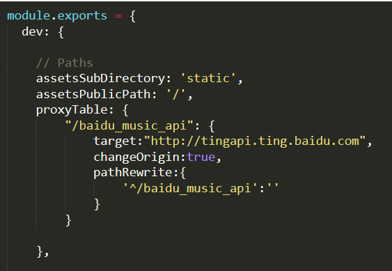

# vuemusic

> A Vue.js project

## Build Setup

``` bash
# install dependencies
npm install

# serve with hot reload at localhost:8080
npm run dev

# build for production with minification
npm run build

# build for production and view the bundle analyzer report
npm run build --report
```

For a detailed explanation on how things work, check out the [guide](http://vuejs-templates.github.io/webpack/) and [docs for vue-loader](http://vuejs.github.io/vue-loader).


通过百度音乐api接口利用vue实现一个音乐播放器<br>
开始是跟着网上的教程做的，基本功能都已经实现，还有一部分功能需要完善，最近有实训，暂时先放一放<br>

### 已完成功能：
1. **首页：** 在首页显示不同的歌曲列表，并可以常查看更多；
2. **歌手页面：**点击某一个歌手，显示这个歌手的全部音乐；  
3. **排行页：** 多种榜单，均可以查看当前榜单的全部音乐； 
4. **搜索页：** 可搜索歌曲名称和歌手名字； 
5. **播放页：** 进度条，歌词适配；  
6. **上拉刷新：** 列表歌曲可以进行上拉刷新加载更多音乐 

### 待完成功能：
1. 完善后台播放，在播放页面添加列表，实现上一首下一首，收藏等；
2. 我的-登录界面的功能实现

### 运行环境及相应软件版本：
1. vue : 3.10.0  
2. webpack : 3.6.0  
3. node : v10.16.2 
  
  百度音乐api接口:转载 https://www.jianshu.com/p/a6718b11fdf1 <br>


### 页面结构

- index.vue 主页面
- home.vue   （头部导航，index页面下面的二级菜单）
  - Today_Recommend.vue 今日推荐  
  - News_Music.vue 新歌速递  
  - Swiper_Banner.vue 轮播图  
  - Music_List.vue 音乐榜单（收到新歌榜，热歌榜，king歌榜的url在榜单中显示，此文件不在home文件注入）
  - music_listnav.vue 音乐榜单的导航（此文件不home文件注入）
   - hot_list.vue 热歌榜 
   - news_list.vue 新歌榜  
   - king_list.vue king歌榜 
- aritists.vue  歌手页面（头部导航，跳转到artistsDetails.vue页面，在该页面下又引入title头像和list音乐列表文件  
- listcate.vue 榜单页面（头部导航，在本文件中注入 ListCate_List.vue 各个歌曲类型的榜单） 
- ucente.vue 我的页面（头部导航） 
- search.vue 搜索页面（头部导航）  
- morelist.vue 更多页面  
- musicplay.vue 播放页面 


### 在config目录下的index.js加上如下代码，解决跨域问题

